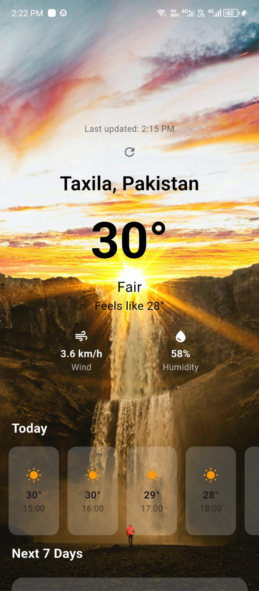
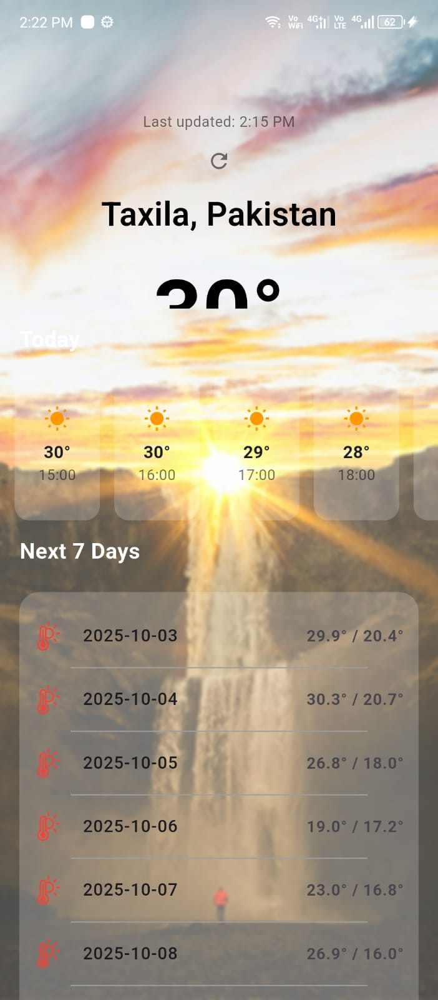
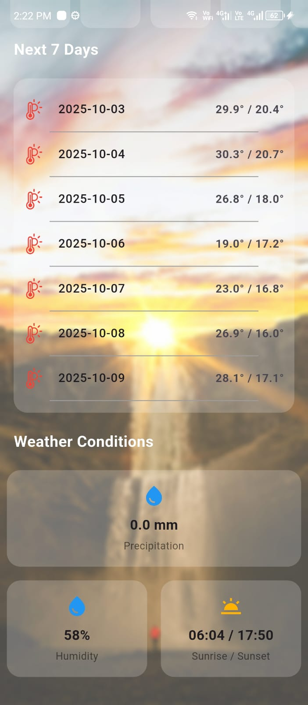

# 🌦 Weather App

A Flutter-based weather application that provides real-time weather updates based on the user's current location. The app fetches weather data using the **Open-Meteo API** and displays it with a clean and modern UI. It also supports **caching**, so previously fetched weather data can be shown instantly, even if the network is slow or unavailable.

---

## ✨ Features

- 📍 **Location-based weather**: Automatically detects user location using GPS.
- 🌤 **Current Weather Data**: Displays temperature, humidity, wind speed, rain probability, and more.
- ☁️ **Weather Icons**: Dynamic icons (sunny, cloudy, rainy, etc.) to represent current conditions.
- ⚡ **Error Handling**: Shows cached data if new data fails to load.
- 💾 **Caching Support**: Stores last fetched weather for offline/slow connections.
- 🎨 **Modern UI**: Blurred background, gradient overlays, and smooth animations.
- 📱 **Responsive Design**: Works across different screen sizes.

---

## 🛠 Tech Stack

- **Framework:** Flutter (Dart)
- **State Management:** Provider
- **API:** [Open-Meteo Weather API](https://open-meteo.com/)
- **Geolocation:** Geolocator & Geocoding
- **Local Storage:** Shared Preferences (for caching)

---

## 🚀 How It Works

1. **Get Current Location**
   - Uses GPS to detect latitude and longitude.
2. **Fetch Weather Data**
   - Calls the Open-Meteo API with the detected coordinates.
3. **Format & Display**
   - Converts raw data into user-friendly weather stats.
   - Displays temperature, rain probability, humidity, etc.
4. **Caching**
   - Saves last fetched weather locally for offline use.
5. **UI**
   - Weather conditions displayed with dynamic icons (☀️ 🌧 🌥).
   - Blur effect applied when scrolling.

---

## 📸 Screenshots

<p align="center">
  
  
  
</p>

---

## ⚙️ Installation & Setup

1. Clone this repository:
   ```bash
   git clone https://github.com/yourusername/weather-app.git
   cd weather-app
   flutter pub get
   flutter run


